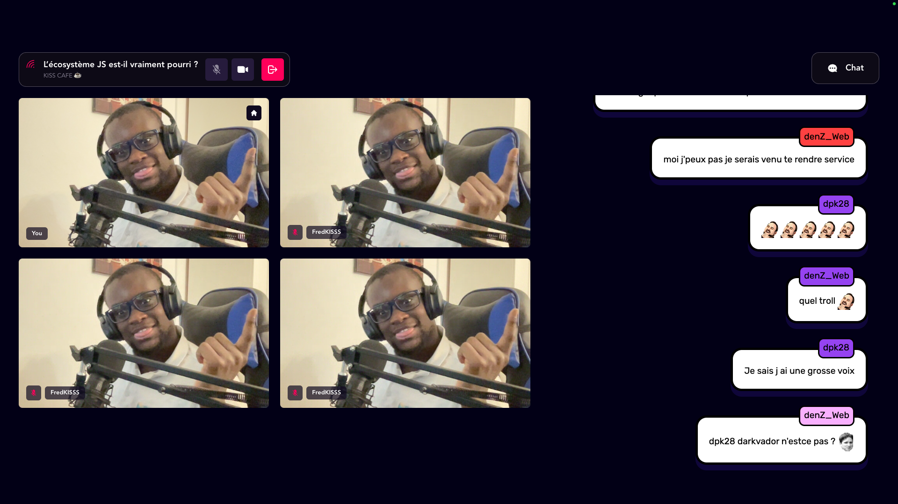

<p align="center">
  <a href="https://kisscam.fredkiss.dev">
    
  </router-link>
</p>

# KISSCAM ❤️📸 


### KISSCAM helps you host your video podcasts on twitch without any constraint
### KISSCAM is a web app that allows you to call your friends and family without a time limit.


# Requirements

- Node >= v16.6.2
- [PNPM](https://pnpm.io/installation) >= v7.1.0
- [docker](https://docs.docker.com/engine/install/)
- [docker-compose](https://docs.docker.com/compose/install/)

## 🚀 How to work on the project ?

1. **First you have to clone the repository :**
    
    ```bash
    git clone https://github.com/Fredkiss3/kisscam.git
    ```    

2. **Install the dependencies :**

    ```bash
    pnpm install --shamefully-hoist
    ```    
3. **Build the shared lib package :**

    ```bash
    cd shared
    pnpm run build
    ```

4. **Run the docker-compose to launch the redis database :**

    ```bash
    cd back
    docker-compose up -d
    ```

5. **Copy the env file for setting environment variables :**
   
    ```bash
    # the backend
    cd back
    cp .env.example .env.local
    ```
    
    ```bash
    # the frontend
    cd front
    cp .env.example .env.local
    ```

6. **And launch the project :**

    ```bash
    # the backend
    cd back
    pnpm run dev
    ```

    ```bash
    # the frontend
    cd front
    pnpm run dev
    ```

    The API will be available at http://localhost:8080 and the frontend client at http://localhost:3000.

7. **Open the source code and start rocking ! 😎**


## 🧐 Project structure

A quick look at the top-level files and directories you will see in this project.

    .
    ├── .github/
    │    └── workflows
    │        ├── back.yml
    │        └── front.yml
    ├── back/
    ├── front/
    ├── .prettierrc
    ├── pnpm-workspace.yaml
    ├── pnpm-lock.yaml
    └── tsconfig.json

1. **`.github/`**: this folder contains the GitHub Actions workflow configuration for Continuous Integration/Continuous Deployment.
   Given that this project is a [monorepo](https://www.wikiwand.com/en/Monorepo), there is muliples workflows for the different packages, with each one targeting a specific environment :
   
    1. **`back.yml`** : this workflow is used to deploy the backend.
   
    2. **`front.yml`** : this workflow is used to test and deploy the frontend app.
   
2. **`back/`** : this package contains the API mainly implemented with socket.io.   

3. **`front/`** : this package contains the frontend app written in React.
    
4. **`.prettierrc`**: this file contains the configuration for prettier to enable autoformatting.

5. **`pnpm-workspace.yaml`**: this file contains the configuration for the monorepo.

6. **`pnpm-lock.yaml`**: this file contains the dependencies lock for the monorepo.

7. **`tsconfig.json`**: this file contains the configuration for typescript, that are used by the all the underlying packages


## 💫 Deploy the project

This project is deployed to a custom VPS, with github actions.
You can consult the files in `.github/workspaces` to see the different CI/CD scripts.

## 🔐 ENV variables

This project uses some environment variables to configure the project.
### 🍳 List of the variables

| name        | description                                              | used by |
| ----------- | -------------------------------------------------------- | ------- |
| REDIS_URL   | the url to the redis database where room data are stored | backend |
| VITE_WS_URL | the api server URL                                       | front   |
